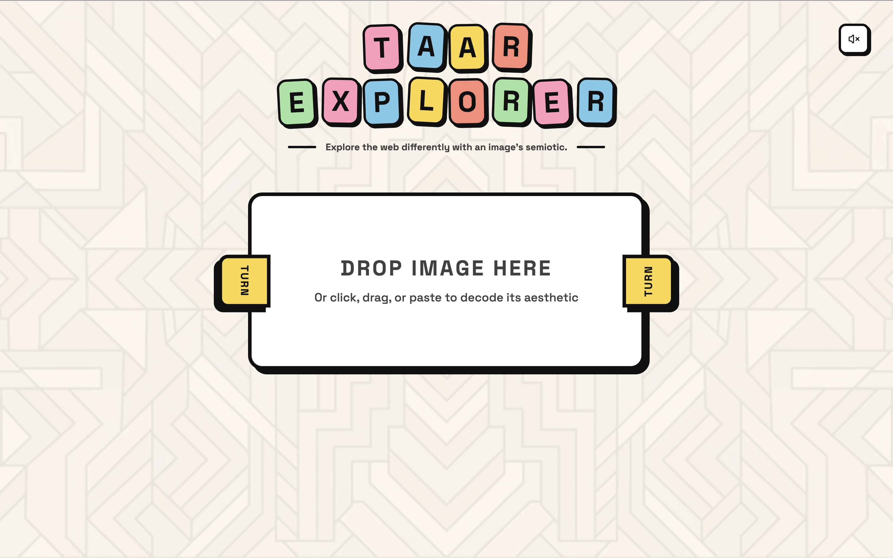

<div align="center">

# Taar Explorer

**An interactive web app that stimulates the web with an image, surfacing everything it evokes.**

[](https://taar-explorer.onrender.com)
[](LICENSE)



</div>

## Overview

Taar Explorer helps to make the web exciting again: drop in an image, or a whole collection, and it decodes the mood, aesthetic, color palette, typography, and cultural influences it carries, then uses that reading as a compass to explore the rest of the web. The goal isn't just to describe a picture but to explore the web differently, through an image's semiotics, its deeper meaning, by turning that reading into curated search queries, cross-media recommendations, and an ambient soundscape that matches what the image feels like.

*It can resurface forgotten movies, series, ideas or even new ones !*

**[→ Try the live demo](https://taar-explorer.onrender.com)**

## Features

- **Multimodal AI analysis** : Gemini reads the image (or collection) to decode its moods, artistic style, color palette, typography, and which world continent(s) culturally influence it, down to details like motifs, jewelry, clothing cuts, and fabrics, plus a "twist" detector that calls out any uncanny or subverted element in the frame.
- **Cross-recommendations** : the same aesthetic reading drives AI-picked movies/TV, novels, and artists that share its mood and visual language, not just its literal subject matter, with more suggestions generatable on demand.
- **Enrichment via the Wikipedia API** : every recommendation is cross-referenced against Wikipedia to attach a real illustrative image, so a suggested film, book, or artist comes with a face rather than a blank card.
- **Curated web exploration** : the analysis is translated into diverse, mood-driven search queries across YouTube, Wikipedia, and Reddit, organized into categories, with an on-demand preview of what each search is likely to surface.
- **Aesthetic mismatch detector** : for multi-image collections, a dedicated pass flags any image that breaks the group's visual cohesion and explains why in plain language.
- **Guided visual annotation** : an AI "guide" points out and comments on the 3 to 5 specific visual elements that build the image's aesthetic, plotted directly on the canvas.
- **Adaptive ambient audio** : a generative soundscape (Web Audio API,  oscillators, an LFO-driven filter) is tuned live to the decoded mood and aesthetic, so the exploration has a matching sound, not just a look. It is not on point yet, still work in progress.
- **Seamless multi-image collection management** : upload and switch between several images in one session, each keeping its own analysis, recommendations, and annotations.
- **Cubist / art-deco interface** : animated letter tiles, thick borders, hard drop shadows, and a mouse-following eye, ported from an earlier "Cubist Notes" prototype.

## Content safety

Before the image semiotic is decoded, a dedicated moderation pass classifies it into one of a handful of categories. If anything sensitive is detected, the app skips the analysis entirely and shows a plain-language notice instead.

| Category | What it catches | What the app does |
|---|---|---|
| Sexual/intimate content involving an apparent minor | Highest priority, always wins over every other category | Hard block : a neutral, non-descriptive refusal, no further processing |
| Self-harm / suicide risk | Content suggesting a real, personal crisis | A supportive notice with crisis-line resources, no semiotic check |
| Dangerous content | Real weapons, violence, gore, extremist content | Blocked with a neutral notice |
| Real depictions of death | A real deceased person or graphic aftermath | Blocked, out of respect, no lighthearted breakdown |

Costumes, movie/game stills, historical or documentary photography, dark fashion/art, and ordinary photos of minors are deliberately **not** flagged — the classifier is tuned to catch content that's genuinely, literally about one of the categories above, not anything merely dark or thematically adjacent.

The classifier prompt itself is part of the private orchestration module (see the note below), consistent with the rest of the AI logic. Two things worth knowing if you're evaluating or building on this:

- **This is a best-effort AI classifier, not a certified detection system.** In particular, it is *not* a substitute for hash-matching CSAM detection (e.g. Thorn Safer, Google CSAI Match, Microsoft PhotoDNA) and does not fulfill any legal reporting obligation on its own (e.g. US providers must report apparent CSAM to NCMEC's CyberTipline under 18 U.S.C. §2258A). Anyone taking this to production with real public uploads should bring in a dedicated provider and legal counsel first.
- **It fails open.** If the classifier call itself errors out (network hiccup, malformed response), the image is treated as safe rather than blocking the app, a deliberate reliability trade-off that's worth reconsidering (fail-closed) for a public deployment.


## Tech stack

| Layer | Technology |
|---|---|
| Frontend | React 19 + Vite, Tailwind CSS v4, Motion (Framer Motion), Lucide icons |
| AI analysis & writing | [Google GenAI API](https://ai.google.dev/) (Gemini) |
| Enrichment | [Wikipedia API](https://www.mediawiki.org/wiki/API:Main_page) |
| Ambient sound | Web Audio API (hand-rolled synth, no audio files) |
| Backend | [Express](https://expressjs.com/) (Node), served alongside Vite in dev and as a static host in production |
| Deployment | [Render](https://render.com/) (see `render.yaml`), Docker-compatible |

## Project structure

```
taar-explorer/
├── index.html          # Vite entry point
├── server.ts           # Express route layer (see note below)
├── src/
│   ├── App.tsx
│   ├── components/
│   │   ├── AestheticExplorer.tsx   # main app: upload, analysis view, recommendations
│   │   └── cubist/CubistUI.tsx     # cubist/art-deco UI chrome
│   ├── hooks/useAdaptiveAudio.ts   # mood-reactive Web Audio synth
│   ├── assets/images/              # UI background art
│   └── index.css
├── Dockerfile
├── render.yaml
└── assets/
    └── screenshot.png
```

### A note on what's not in this repo

This is a public snapshot of the project's frontend and route layer, kept for portfolio and code-review purposes. The actual AI orchestration; the Gemini prompt engineering behind each analysis, the response schemas, the aesthetic-mismatch and recommendation logic, and the Wikipedia enrichment pipeline; lives in a private module (`./ai/orchestration`) that isn't included here. `server.ts` still shows the real API surface (every endpoint, its inputs and outputs), just not the prompts and logic behind it, since that's the part of the project I've iterated on the most and I'm keeping it closed for now.

If you'd like to know more, discuss the implementation, or need access for a specific purpose, reach out: **aichakorovaev@gmail.com**.

## Running it locally

The frontend runs on its own for UI work, but full functionality (image analysis, recommendations, search enrichment) needs the private orchestration module described above.

```bash
git clone https://github.com/<your-username>/taar-explorer.git
cd taar-explorer
npm install
npm run dev
```

The app runs at `http://localhost:3000`. Without the private `./ai/orchestration` module, `npm run dev` will start but the `/api/*` routes will fail to build/run — see the note above if you need working endpoints.

### Deploying

This repo ships with a `render.yaml` Blueprint for [Render](https://render.com) and a `Dockerfile` for any Docker host, both wired for a Node/Express deployment. Either will need the private orchestration module in place to actually serve working API responses.

## License

The source code shown here is MIT-licensed — see [LICENSE](LICENSE). This license covers the code in this repository only; it does not extend to the private orchestration module described above.
